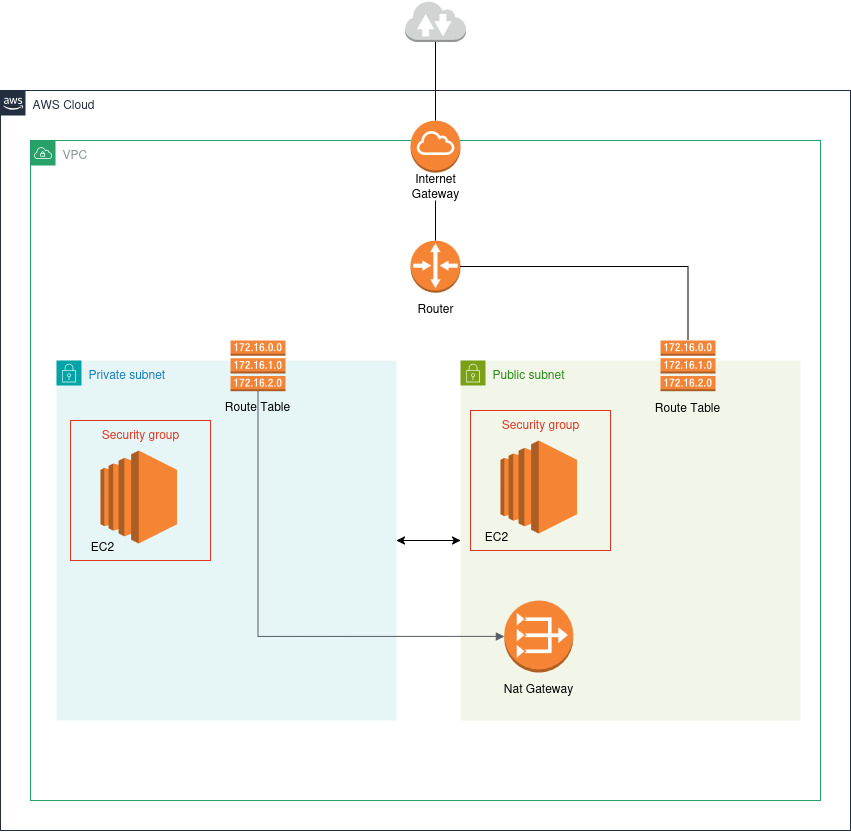

# Terraform - Provisioning AWS Instances and Network configuration

Provisoning two EC2 instances, one in a public subnet and the other in a private subnet.

The public instance can access the internet, but it can only be accessed through SSH, as configured by the security group.

The private instance can access the internet, as it has a NAT Gateway attached to the private subnet. But it can only be accessed through SSH inside the VPC, which means that no one from the public internet can reach the instance.

## Resources

- EC2 Instances

- VPC

- Public and Private Subnet

- Internet Gateway 

- Nat Gateway

- Security Groups

- KeyPair

## How to run

- Make sure you have an AWS account.

- Install Terraform and AWS CLI

- Login to AWS CLI using sso `aws configure sso` 

- Initiate the terraform aws provider `terraform init`

- Generate an SSH key to be able to ssh into the instace `ssh-keygen -t rsa -b 2048 -f ~/.ssh/my-ec2-key`

- Run `terraform plan` to see all the changes that will be provisioned

- Run `terraform apply` to apply all the changes

- ssh into the public instance by running `ssh -i ~/.ssh/my-ec2-key ubuntu@INSTANCE_PUBLIC_IP_ADDRESS`

- Run `terraform destroy` to delete all resources